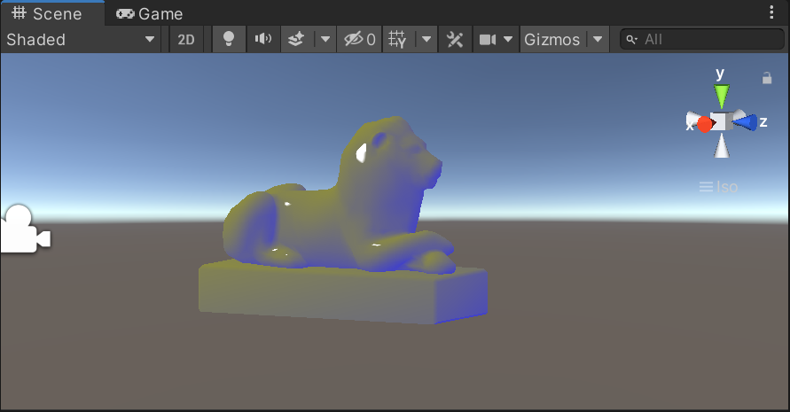
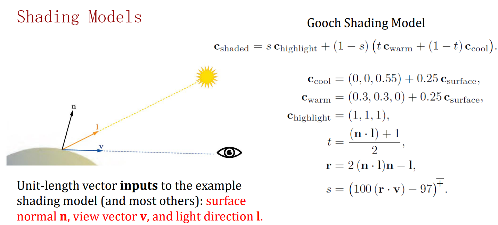
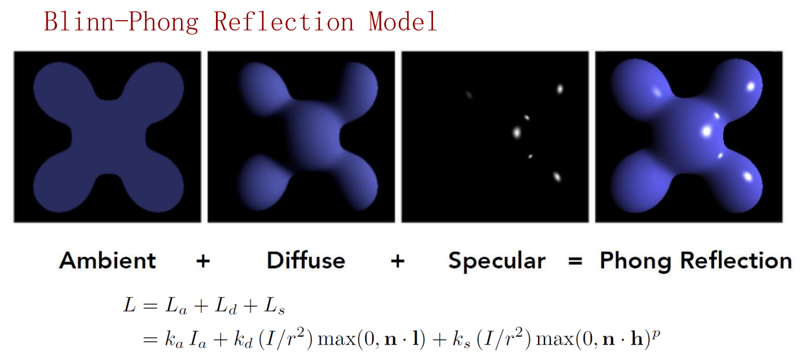
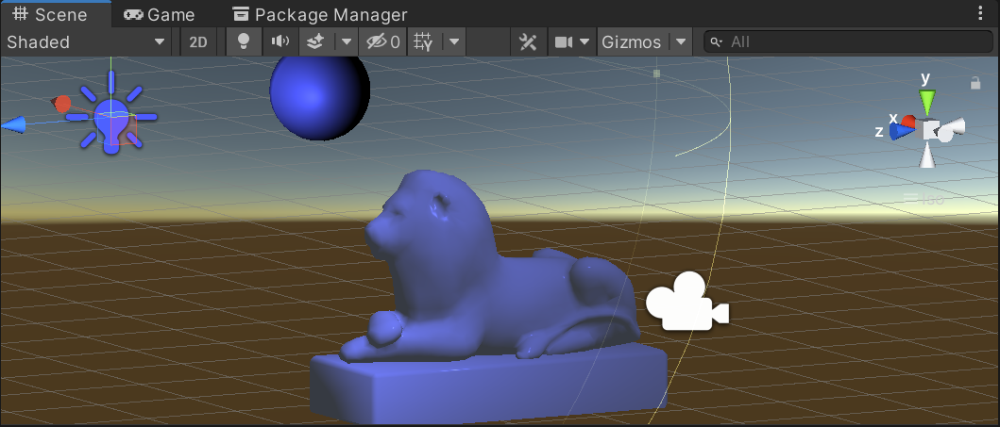
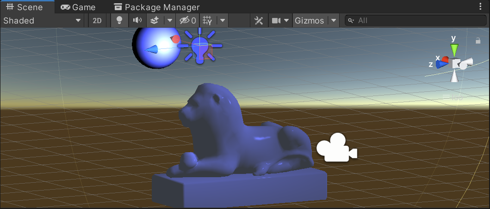
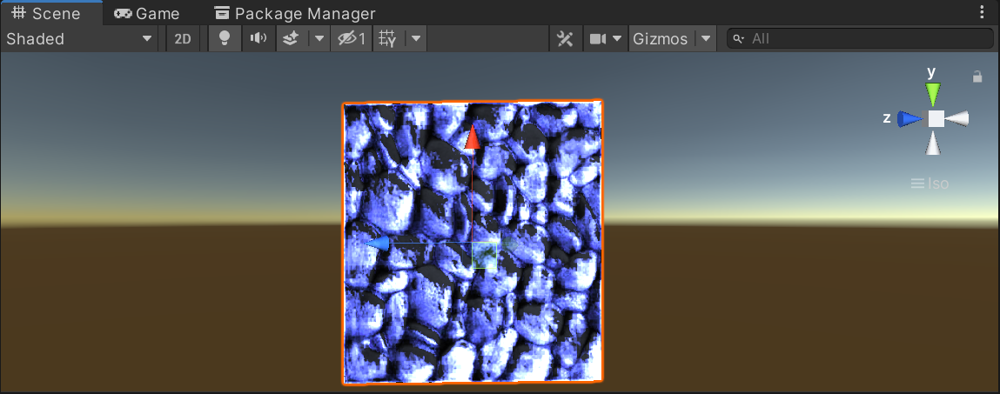
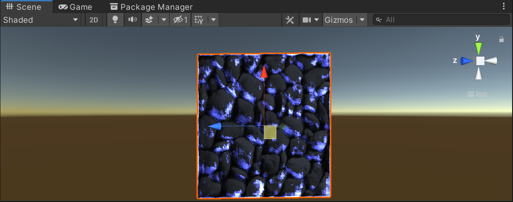
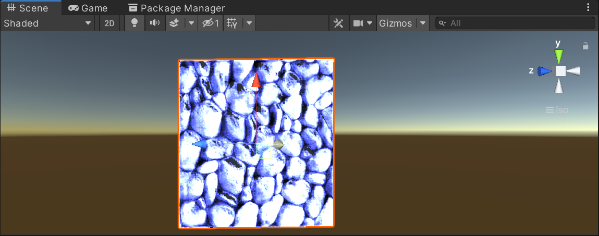
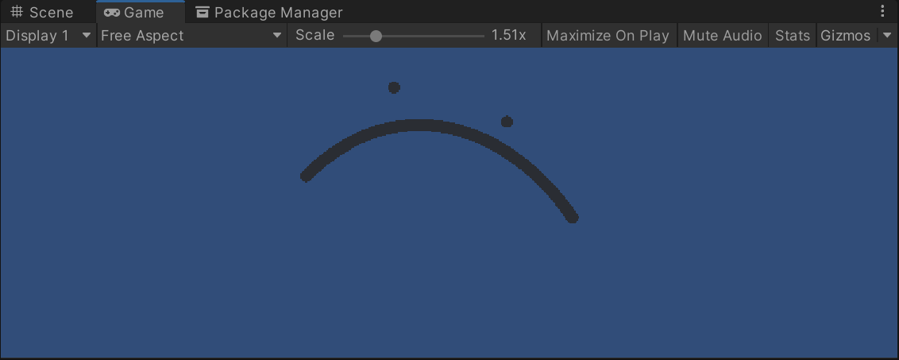
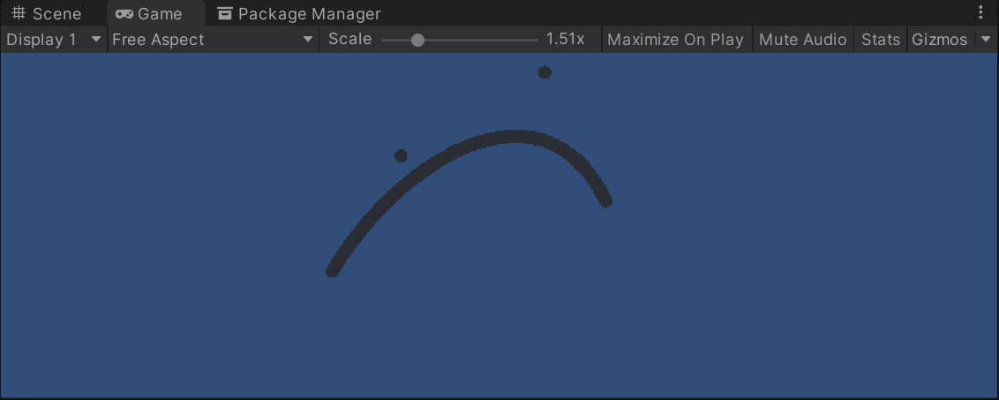

I implemented several basic graphics models in unity.

### Gooch Shading

Relevant codes are in ‘Gooch’ folder. 

One classic non-photorealistic rendering style.





**Core Codes:**

```c#
fixed4 frag(v2f o):SV_TARGET{
                float3 LightDirection=normalize(UnityWorldSpaceLightDir(o.worldPos));
                float3 ViewDirection=normalize(UnityWorldSpaceViewDir(o.worldPos));
                float t=0.5*(dot(o.worldnormal,LightDirection)+1);
                float3 r=2*dot(o.worldnormal,LightDirection)*o.worldnormal-LightDirection;
                float s=saturate(100*dot(r,ViewDirection)-97);

                fixed4 res=s*_Highlight_Color+(1-s)*(t*(_Warm_Color+0.25*_Surface_Color)+(1-t)*(_Cool_Color+0.25*_Surface_Color));
                return res;
            }
```

### Binn-Phong Shadings

Relevant codes are in ‘Blinn-Phong’ folder. 

A specular shading model, consist of ambient, diffuse and specular.



Change position of light source, the shading also changes.





**Core Codes:**

Get the square of the distance between a point and the light source:

```c#
float3 dis=i.worldPos-unity_LightPosition[0].xyz;
float r=dis.x * dis.x + dis.y * dis.y + dis.z * dis.z;
```

Calculate the 3 component of shading:

```c#
fixed3 ambient = UNITY_LIGHTMODEL_AMBIENT.xyz;
fixed3 diffuse =_LightColor0.rgb*_Diffuse.rgb /r* max(0, dot(worldNormal,
worldLightDirection));
fixed3 specular = _LightColor0.rgb*_Specular.rgb/r* pow(max(0,
dot(worldNormal, bisector)), _Gloss);
```

### Bump Map

Relevant codes are in ‘Bump’ folder. 



Change the distance between the plane and the light source, the shading also changes.





**Core Codes:**

Get the normal direction from the normal map:

```c#
fixed3 TangentLightDirection = normalize(i.LightDirection);
fixed3 TangentViewDirection = normalize(i.ViewDirection);
fixed4 BumpValue = tex2D(_BumpMap, i.uv.zw);
fixed3 TangentNormal = UnpackNormal(BumpValue);
TangentNormal.xy *= _BumpScale;
TangentNormal.z = sqrt(1.0 -
(TangentNormal.x*TangentNormal.x+TangentNormal.y*TangentNormal.y));
```

### Bezier Curve

Relevant codes are in ‘Bezier’ folder. 

Draw Bezier curves when interacting. 

When moving the position of points in the scene, the curve can change at the same time.





**Core Codes:**

Get the position of sampling points on the screen according to the position of four key points and update the curve in real time.

```c#
float s = 1 - t;
Vector3 p = p0 * s * s * s + 3 * p1 * t * s * s + 3 * p2 * t * t * s + p3 *
t * t * t;
return p;
```


